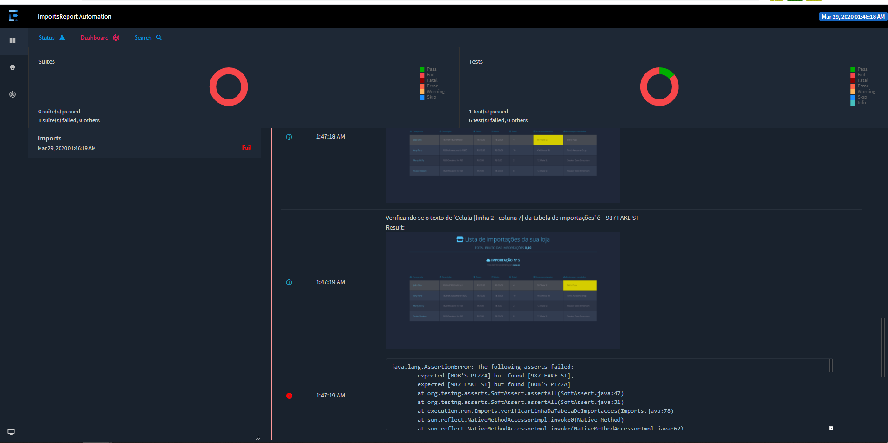
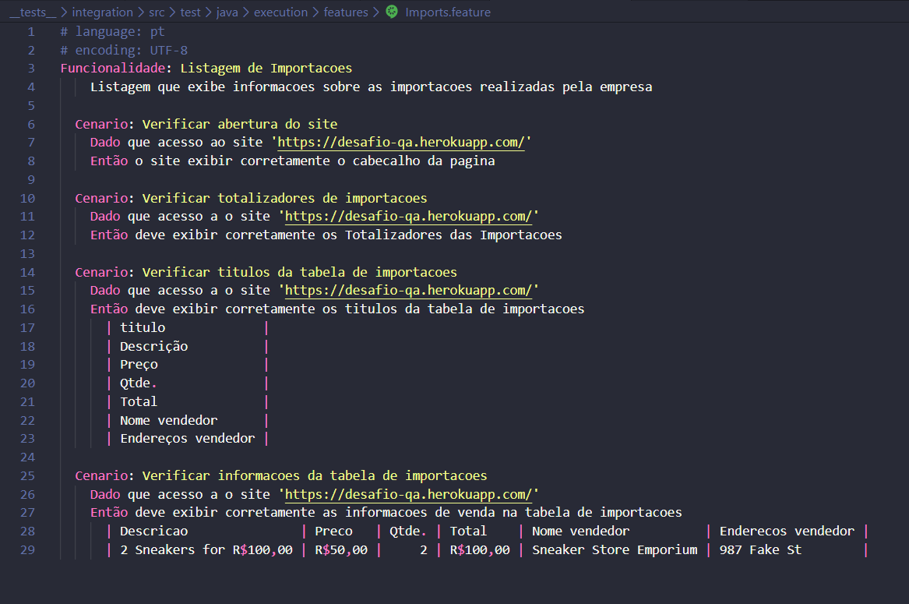
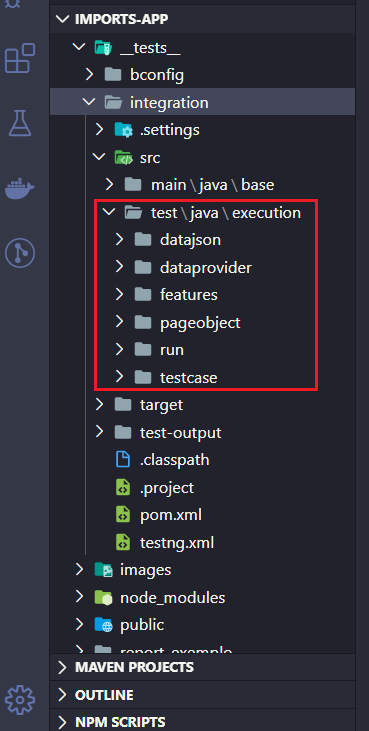
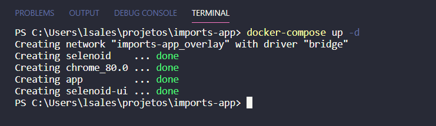
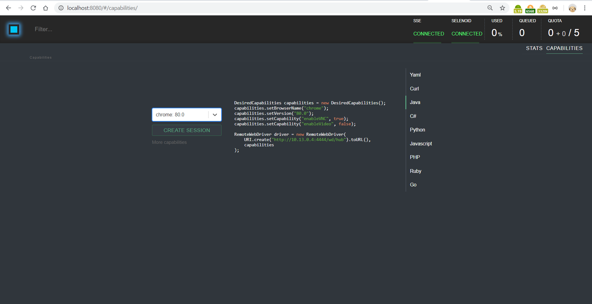
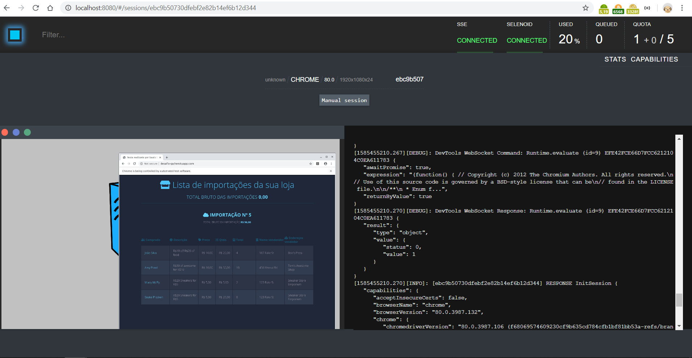
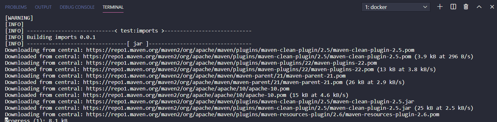
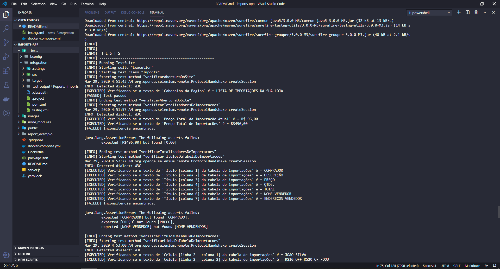
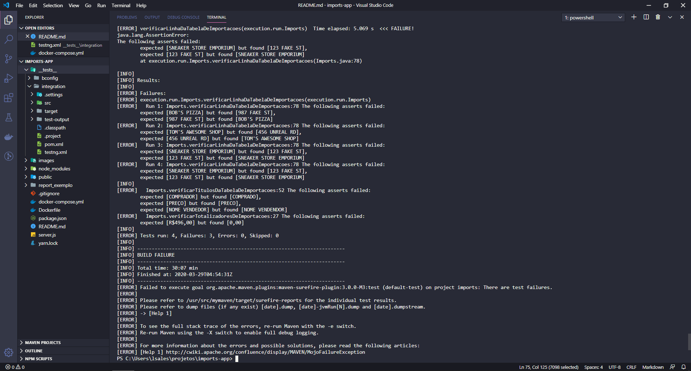
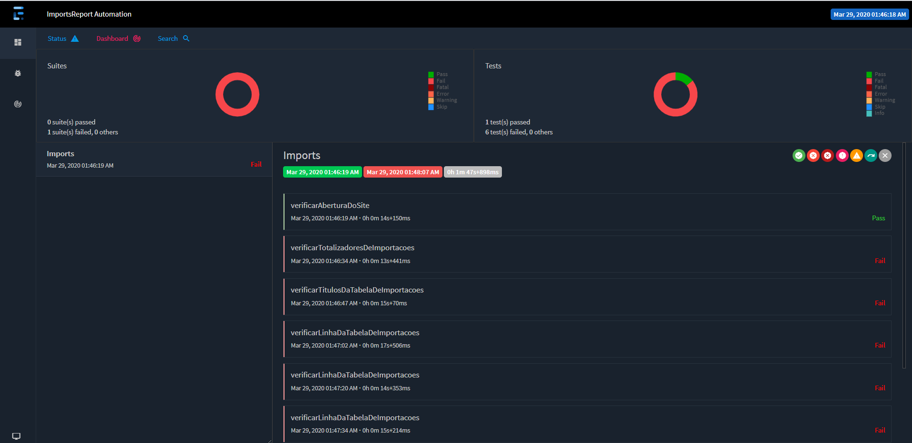

# Desafio QA

Este repositório tem como objetivo realizar a entrega do desafio de qualidade de software.

## Entregáveis do desafio
- ### Um relatório com todos os bugs encontrados, seguindo uma metodologia de sua preferência:
    Os erros foram identificados através das verificações realizadas na execução dos testes automatizados. (vide [relatório da última execução](./report_exemplo/Imports_ExtentReport.html)) em `.../report_exemplo/Imports_ExtentReport.html`.
    Porém, simulando que eu estaria executando testes exploratórios, a fim de identificar capacidade investigativa, segue abaixo uma lista dos bugs que consegui encontrar de forma exploratória: 
    - A descrição do projeto informa que "cada linha da tabela deve ter a descrição do produto, preço, quantidade, total, nome e endereço do vendedor", porém foi encontrada uma coluna a mais. "Comprador" está antecedendo as demais colunas, incorretamente;
    - Caso a coluna "Comprador" realmente devesse estar sendo exibida, a descrição da mesma está incorreta em tela, sendo exibida como "Comprado";
    - A descrição da coluna "Nome vendedor" está incorreta em tela, sendo exibida como "Nome vendendor";
    - A descrição da coluna "Preço" está incorreta em tela, sendo exibida como "Preco";
    - O "Total bruto das Importações" exibe "0,00". Como essa é a importação nº5, irei exemplificar, supondo que cada uma das outras 4 importações sejam de R$100,00, então deveriamos ver o valor total de "R$496,00";
    - O conteúdo das colunas "Nome vendedor" e "Endereços vendedor" estão trocados. 

    Obs.: 
    Sobre as informações de "Descrição", "Preco", "Qtde." e "Total" estão incorretos. Porém, não consegui encontrar uma relação clara entre eles (assim como ficou com as colunas "Nome vendedor" e "Endereços vendedor"). 
    Tendo como base que a coluna "Total" que supostamente está preenchida com os valores que deveriam estar em "Qtde.", não consegui identificar exatamente se os valores estão embaralhados ou se estão incorretos, acredito que estejam os dois, principalmente por causa da "Descrição" que por vezes deveria exibir um valor unitário, mas exibe valor monetário(Ex.: R$20 Sneakers for R$5). 
    Esse seria o caso de analisar o que aconteceu, juntamente com o desenvolvedor (ou diretamente no código).
    No caso dos testes automatizados, inclui que os valores atuais estariam corretos e ajustaria após a analise descrita anteriormente.
    Segue abaixo um exemplo dos valores que acredito que fariam sentido:
            | Descricao               | Preco   | Qtde. | Total    | Nome vendedor          | Enderecos vendedor |
            | 2 Sneakers for R$100,00 | R$50,00 |     2 | R$100,00 | Sneaker Store Emporium | 987 Fake St        |
    
    - #### Imagem de exemplo do relatório
        

- ### Uma suíte de teste pronta para receber testes:
    A minha estratégia de diponibilização de Suítes de testes é com BDD + Cucumber, utilizando os próprios arquivos `.feature`. (vide [Feature criada para tela de importações](./__tests__/integration/src/test/java/execution/features/Imports.feature)) em `.../__tests__/integration/src/test/java/execution/features/Imports.feature`.

    - #### Imagem de exemplo da feature
        

- ### Um teste de integração escrito na suíte que foi montada:
    A estrutura que usei para a codificação dos testes automatizados na linguagem Java, é a seguinte:

    - #### *PageObject*
        - Este pacote tem o objetivo de agrupar as classes de ***Page Object***. Cada classe de *Page Object* representa uma "*Página do sistema*", seus "*Componentes de tela*" e os "*Eventos*" disponíveis para os mesmos. 
	
    - #### *TestCase*
        - Este pacote tem o objetivo de agrupar as classes de ***TestCase***. Cada classe de *Test Case* representa uma ou mais execuções simples de teste (ou seja, um ***Caso de teste***) baseado-se em somente uma "*Página do sistema*" (*Page Object*). 

    - #### *Run*
        - Este pacote tem o objetivo de agrupar as classes de ***Run***. Cada classe de *Run* representa os ***Cenários*** que serão efetivamente executados. Isto é feito, agrupando diversos métodos de *Tests Case*, a fim de atingir o objetivo de uma execução e, ao final a verificação do seu resultado esperado.
        - Associada a execução, é feito o uso da estratégia de ***DataProvider***, para facilitar a identificação dos dados que serão utilizados pelo cenário e atribuir mais execuções para o mesmo cenário, sem a necessidade de nova codificação. (O formato dos dados do DataProvider é *Json*)
        - A fim de documentar e manter os cenários que serão automatizados, é utilizado o BDD como definição do comportamento que o sistema deve atender. User Stories são utilizadas como padrão de escrita desses comportamentos, onde os cenários devem ser escritos de uma forma curta com uma descrição simples da ***Feature***.
    
    - #### Imagem da estrutura de execução
        

- ### Uma documentação de como executa o ambiente de teste:
    - #### Pré requisitos para execução:
        - Possuir [Docker](https://docs.docker.com/install/) instalado;
        - Possuir [Docker Compose](https://docs.docker.com/compose/) instalado;
        - Estar com as portas "3000", "9229", "4444" e "8080" disponíveis;

    - #### Passo a passo para execução:
        - Realizar o Clone do projeto;
        - Acessar o diretório do projeto;
        - Executar o comando `docker-compose up -d`:
            
            1. Ambiente com *Node.js* para disponibilizar o site estático do desafio na porta 3000;
            2. Ambiente com ***[Selenoid](https://aerokube.com/selenoid/)*** para gerenciamento e conteinerização dos browsers que serão utilizados para execução;
            3. Ambiente com ***Selenoid-UI***, que é um client web para uma visualização amigável da execução;
                
                
                
        - Executar o comando `docker run --name MavenExecution --network imports-app_overlay -v <full_path_of (__tests__/integration)>:/usr/src/mymaven -w /usr/src/mymaven maven:3.5.4-jdk-8-alpine mvn clean test`
            
            
            
            1. Caso queira, você poderá realizar alterações no projeto de testes e nos parâmetros de execução ((vide [testng.xml](./__tests__/integration/testng.xml)). Após isso, poderá repetir a execução dos testes com o comando `docker start MavenExecution`.

        - Após a execução, você poderá consultar o relatório gerado no formato HTML em `..../__tests__/integration/test-output/Reports_Imports/Execution_<TIMESTAMP>`
            
            